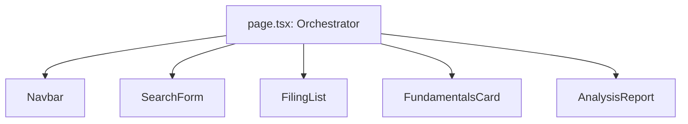

# 어닝 대시보드 리팩토링 아키텍처 명세서 (Architecture Specification)

본 문서는 미국 주식 어닝 대시보드 애플리케이션의 components 및 features 기반 모듈러 아키텍처 리팩토링 설계 내용을 상세히 기록합니다.

---

## 1. 폴더 구조 (Folder Structure)

프로젝트 루트의 `src` 폴더는 재사용성과 독립성을 극대화하기 위해 아래와 같이 리팩토링되었습니다.

```text
src/
├── components/                  # 범용/공통 레이아웃 컴포넌트
│   └── Navbar.tsx               # 최상단 글로벌 헤더 바
├── features/                    # 기능 단위 도메인 디렉토리
│   └── stock-analyzer/          # 어닝 분석 기능 도메인
│       ├── components/          # 해당 기능에서만 사용되는 전용 UI 컴포넌트
│       │   ├── SearchForm.tsx   # 티커 검색 인풋 및 폼
│       │   ├── FilingList.tsx   # SEC 8-K 공시 카드 목록
│       │   ├── FundamentalsCard.tsx  # Yahoo Finance 재무 데이터 카드
│       │   └── AnalysisReport.tsx    # AI 스트리밍 분석 리포트 패널
│       └── types.ts             # 어닝 분석 관련 타입 정의 (Filing, Fundamentals 등)
├── app/                         # Next.js App Router 엔트리 및 API 라우트
│   ├── api/                     # 백엔드 API 엔드포인트
│   │   ├── sec/                 # SEC CIK 매핑 & 8-K 수집 API
│   │   └── market/              # 주식 기본적 재무 정보 API
│   ├── page.tsx                 # 대시보드 메인 페이지 (상태 관리 오케스트레이터)
│   ├── schema.ts                # 클라이언트-서버 간 Zod 분석 스키마 (Shared)
│   ├── globals.css              # 전역 스타일시트 (Tailwind CSS v4)
│   └── layout.tsx               # Next.js 글로벌 레이아웃
```

---

## 2. 컴포넌트 계층 및 상태 흐름 (Component Hierarchy & State Flow)

메인 페이지인 [page.tsx](file:///Users/jeongjiwon/Documents/antigravity/stock-analyzer/src/app/page.tsx)는 어플리케이션의 최상단 컨테이너로서 상태(State) 관리와 API 요청을 조율하는 **오케스트레이터(Orchestrator)** 역할을 담당합니다.

### 컴포넌트 구조도


### 상태(State) 설계
- `tickerInput`: 사용자가 입력창에 작성 중인 임시 검색어 상태
- `activeTicker`: 실제 조회가 시작된 타겟 티커 상태
- `filings`: SEC로부터 받아온 최신 8-K 공시 메타데이터 목록 상태
- `fundamentals`: Yahoo Finance에서 연동한 기본적 분석 지표 및 분기 EPS 리스트 상태
- `activeFiling`: 사용자가 분석을 활성화한 타겟 공시 객체 상태
- `analysis` (`useObject`): 백엔드 스트리밍 API로부터 수신하여 클라이언트 측 Zod 검증을 필터링하며 실시간 갱신되는 분석 리포트 JSON 객체 상태

---

## 3. 데이터 흐름 및 런타임 안정성 (Data Flow & Runtime Safety)

### 데이터 및 이벤트 라이프사이클

```mermaid
sequenceDiagram
    actor User as 사용자
    participant Front as page.tsx (Client)
    participant SEC_API as /api/sec (Server)
    participant Market_API as /api/market/... (Server)
    participant Stream_API as /api/sec/analyze/stream (Server)
    participant Gemini as Gemini 3.5 Flash (AI)

    User->>Front: 티커 입력 후 검색 ("NVDA")
    rect rgb(20, 30, 40)
        Front->>SEC_API: GET /api/sec?ticker=NVDA
        SEC_API-->>Front: CIK 조회 및 최근 8-K 5개 리스트 반환
        Front->>Market_API: GET /api/market/fundamentals?ticker=NVDA
        Market_API-->>Front: Trailing PE, PBR 및 EPS 내역 반환
    end
    Front-->>User: 공시 목록 및 기초 재무 카드 렌더링

    User->>Front: 특정 공시 "AI 분석하기" 클릭
    Front->>Stream_API: POST /api/sec/analyze/stream { url, ticker }
    Stream_API->>Gemini: streamObject 요청 (Zod Schema 강제)
    Gemini-->>Stream_API: 부분적 JSON 텍스트 스트림 생성
    Stream_API-->>Front: text/event-stream 전송 (SSE)
    loop 실시간 스트림 파싱
        Front->>Front: useObject 훅이 부분 JSON 실시간 누적 업데이트
        Front-->>User: AnalysisReport가 입력되는 요소를 게이지 바 및 카드로 즉각 반영
    end
```



### 4. 런타임 롤백 및 예외 방지 (Runtime Safety)
스트리밍 파싱 중에는 스키마 필드가 불완전하게 구성될 수 있습니다(예: `context` 객체는 파싱되었으나 `context.keyDrivers` 배열은 아직 도착하지 않은 시점).
- **런타임 에러 해결**: [AnalysisReport.tsx](file:///Users/jeongjiwon/Documents/antigravity/stock-analyzer/src/features/stock-analyzer/components/AnalysisReport.tsx) 컴포넌트는 아래와 같이 안전한 기본값 대입 패턴(Nullish Coalescing)을 사용하여 스키마 파싱 과도기 시점의 `TypeError: Cannot read property of undefined` 에러를 원천 방지합니다.

```typescript
// partial stream이 갱신되는 동안 undefined 에러를 예방하기 위한 Fallback 세팅
const keyDrivers = analysis?.context?.keyDrivers ?? [];
const riskFactors = analysis?.context?.riskFactors ?? [];
```
